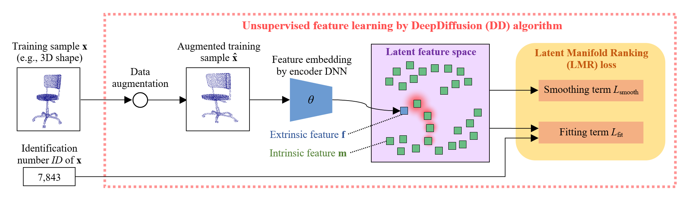

# DeepDiffusion
## Introduction
This repository provides the code of the DeepDiffusion algorithm for ***unsupervised learning of retrieval-adapted representations***. 
The DeepDiffusion algorithm is proposed in the following paper.<br>
```
Takahiko Furuya and Ryutarou Ohbuchi,
"DeepDiffusion: Unsupervised Learning of Retrieval-adapted Representations via Diffusion-based Ranking on Latent Feature Manifold",
Currently under review.
```

DeepDiffusion learns retrieval-adapted feature representations via ranking on a latent feature manifold. By minimizing our Latent Manifold Ranking loss, the encoder DNN and the latent feature manifold are optimized for comparison of data samples. DeepDiffusion is applicable to a wide range of multimedia data types including 3D shape and 2D image. Unlike the existing supervised metric learning losses (e.g., the contrastive loss and the triplet loss), our DeepDiffusion is capable of learning representations suitable for information retrieval in a fully unsupervised manner. 
<br>

The instruction below describes how to prepare data (here, we use 3D point sets of the ModelNet10 dataset as an example) and how to train/evaluate feature representations by DeepDiffusion.

## Pre-requisites
Our code has been tested with Python 3.6, Tensorflow 1.13 and CUDA 10.0 on Ubuntu 18.04.<br>
Python packages required to run the code can be installed by executing the command below. <br>
```
pip install tensorflow-gpu==1.13.2 scipy scikit-learn h5py sobol sobol_seq
```

## Preparing Data
Run the shell script "Prepare_ModelNet10.sh". 
This script downloads the ModelNet10 dataset and converts the 3D surface models contained the dataset to 3D point sets. These 3D point sets will be saved in the "data" directory.

## Training the DNN by using DeepDiffusion and evaluating learned feature representations
Run the shell script "TrainAndTest_3DShape.sh". 
By running this script, the PointNet \[Qi, Su et al. 2017] encoder is trained from scratch in an unsupervised manner. During the training of 300 epochs, retrieval accuracy in Mean Average Precision (MAP) of the testing datasets will be evaluated at every 10 epochs.
If the training proceeds successfully, you will obtain a MAP score of nearly 80 %.  
